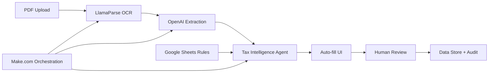

# 🚀 AI-Powered Invoice Processing Automation for India

[](https://make.com)
[](https://openai.com)
[](https://llamaparse.com)
[](https://opensource.org/licenses/MIT)

> **From 5 Days to 30 Seconds**: Transforming manual invoice processing into fully automated, AI-powered GST/TDS compliance with complete audit trails.

## 🎯 Problem Statement

Manual invoice processing in Indian businesses involves:
- ⏰ **5-day processing cycle** across 3 different people
- ❌ **Error-prone manual entry** of GST/TDS fields
- 📊 **Scattered business rules** in spreadsheets and tribal knowledge
- 🔍 **No unified audit trail** for compliance
- 💰 **High operational costs** and compliance risks

## ✨ Our Solution

**"We turned a 5-day, 3-person workflow into a 30-second, 1-person review with fully auditable AI"**

### 🏗️ Architecture Overview



## 🛠️ Tech Stack

| Component | Technology | Purpose |
|-----------|------------|---------|
| **Orchestration** | Make.com | End-to-end workflow automation |
| **OCR Engine** | LlamaParse | High-accuracy PDF → Markdown conversion |
| **AI Extraction** | OpenAI GPT-4 | Structured JSON field extraction |
| **Tax Intelligence** | Custom Agent | India-specific GST/TDS processing |
| **Rules Engine** | Google Sheets | Live, editable business rules |
| **Data Store** | Make.com Data Store | Audit trail and processed data |
| **Frontend** | Auto-fill UI | Human review interface |

## 🇮🇳 India-Specific Features

### GST Processing
- **Smart GST Split**: Automatically determines IGST vs CGST+SGST based on supplier GSTIN and Place of Supply
- **Tax Validation**: Derives GST rates from invoice math and identifies under-taxation
- **Compliance Check**: Computes additional GST payable when invoices are under-taxed

### TDS Processing
- **Section Classification**: Automatically selects appropriate TDS sections (194J, 194C, 194H, 194I, etc.)
- **Rate Application**: Applies correct TDS rates with 206AA/206AB penalty overrides
- **Base Calculation**: Computes TDS on base or gross amounts per regulatory requirements

### GL Code Mapping
- **Intelligent Matching**: Vendor-based matching → HSN/SAC prefix logic → fallback rules
- **Finance-Friendly**: Rules maintained in Google Sheets by Finance team

## 🚀 Key Features

### ⚡ Speed & Efficiency
- **30-second processing**: Upload to audit-ready result
- **99.93% time reduction**: From 5 days to 30 seconds
- **66% staff reduction**: 3 people → 1-2 reviewers

### 🎯 Accuracy & Intelligence
- **High-accuracy OCR**: Tuned specifically for invoice formats
- **Deterministic rules**: Combined with LLM guardrails
- **Explainable AI**: Returns rationale for every tax decision

### 📊 Auditability & Compliance
- **Complete audit trail**: Every decision logged with timestamps
- **Live rules**: Externalized to Google Sheets with version control
- **Human oversight**: Reviewer can edit before final processing
- **ERP-ready output**: Clean JSON with GL codes and totals

## 🔄 Workflow

1. **Upload**: PDF invoice uploaded via HTTP endpoint
2. **OCR**: LlamaParse converts PDF → structured Markdown
3. **Extract**: OpenAI extracts structured JSON fields
4. **Enrich**: Tax Agent adds TDS section/rate/amount + GST validation + GL mapping
5. **Review**: Auto-filled form presented for human verification
6. **Store**: Complete audit trail saved to Data Store
7. **Output**: ERP-ready JSON with all tax and accounting data

## 📈 Impact Metrics

| Metric | Before | After | Improvement |
|--------|--------|--------|-------------|
| **Processing Time** | 5 days | 30 seconds | 99.93% faster |
| **Staff Required** | 3 people | 1-2 reviewers | 66% reduction |
| **Touch Points** | Multiple handoffs | Single review | Streamlined |
| **Audit Coverage** | Fragmented | 100% automated | Complete |
| **Error Rate** | High (manual) | <1% exceptions | Dramatic reduction |
| **Cost per Invoice** | High | 5-8x reduction | Significant savings |

## 🏃‍♂️ Quick Start

### Prerequisites
- Make.com account with premium features
- OpenAI API key
- LlamaParse API key
- Google Sheets access for rules management

### Setup Steps

1. **Clone the Make.com scenario**
   ```bash
   # Import the scenario blueprint (blueprint.json) into your Make.com account
   ```

2. **Configure API connections**
   - Add OpenAI API key to Make.com connections
   - Add LlamaParse API key to Make.com connections
   - Connect Google Sheets for rules management

3. **Set up Google Sheets**
   - Create GL Code mapping sheet
   - Create TDS rules sheet
   - Configure vendor master data

4. **Configure webhooks**
   ```bash
   # Set up HTTP webhook endpoint in Make.com
   # Configure UI frontend to post to webhook URL
   ```

5. **Test the workflow**
   - Upload sample invoice PDF
   - Verify OCR extraction
   - Check tax calculations
   - Review audit trail

## 📋 API Reference

### Input Format
```json
{
  "file": "base64_encoded_pdf",
  "filename": "invoice.pdf",
  "vendor_hint": "supplier_name_optional"
}
```

### Output Format
```json
{
  "extracted_fields": {
    "invoice_number": "INV-2024-001",
    "date": "2024-01-15",
    "vendor_gstin": "22AAAAA0000A1Z5",
    "hsn_sac": "998314",
    "base_amount": 100000,
    "cgst": 9000,
    "sgst": 9000,
    "total": 118000
  },
  "computed_fields": {
    "tds": {
      "section": "194J",
      "rate_percent": 2.0,
      "base_rule": "gross",
      "tds_amount": 2360,
      "flags": ["206AA_applied"]
    },
    "gst": {
      "derived_rate_percent": 18.0,
      "expected_tax_total": 18000,
      "payable_extra_gst": 0,
      "computed_total": 118000
    },
    "accounting": {
      "gl_code": "5200001",
      "gl_name": "Professional Services"
    }
  },
  "explanation": [
    "TDS Section 194J applied for professional services",
    "2% TDS rate with 206AA surcharge (total 2.0%)",
    "GST rate verified at 18% - correctly applied",
    "GL code mapped based on HSN prefix and vendor category"
  ],
  "audit_trail": {
    "timestamp": "2024-01-15T10:30:00Z",
    "processing_time_seconds": 28,
    "rules_version": "v1.2.3"
  }
}
```

## 🔧 Configuration

### Google Sheets Structure

#### GL Mapping Sheet
| Column | Description | Example |
|--------|-------------|---------|
| vendor_contains | Vendor name pattern | "Accenture" |
| hsn_prefix | HSN/SAC prefix | "9983" |
| gl_code | GL account code | "5200001" |
| gl_name | GL account name | "Professional Services" |

#### TDS Rules Sheet
| Column | Description | Example |
|--------|-------------|---------|
| section | TDS section | "194J" |
| description | Service type | "Professional Services" |
| rate_normal | Standard rate | 2.0 |
| rate_206aa | With 206AA | 4.0 |
| base_rule | On gross/net | "gross" |

## 🛡️ Security & Compliance

### Data Security
- **API Keys**: Stored securely in Make.com connections
- **Least Privilege**: Minimal required permissions
- **Audit Logging**: Complete processing trail
- **Data Retention**: Configurable retention policies

### Compliance Features
- **GST Compliance**: Handles all GST scenarios per Indian tax law
- **TDS Compliance**: Covers all applicable TDS sections
- **Audit Trail**: Immutable record of all processing decisions
- **Human Oversight**: Mandatory review before final processing

## 🗺️ Roadmap

### Phase 2: Enhanced Validation
- [ ] Multi-level approval workflows
- [ ] Vendor 206AB status validation
- [ ] PAN verification integration
- [ ] YTD TDS threshold tracking

### Phase 3: ERP Integration
- [ ] Direct ERP voucher creation
- [ ] Webhook callback system
- [ ] Email/Slack approval workflows
- [ ] Real-time status updates

### Phase 4: Intelligence & Automation
- [ ] Confidence scoring system
- [ ] Exception routing logic
- [ ] Vendor master synchronization
- [ ] Predictive tax classification

## 📊 Monitoring & Analytics

### KPIs Tracked
- **STP Rate**: Percentage of straight-through processed invoices
- **Processing Time**: Average time from upload to completion
- **Exception Rate**: Percentage requiring manual intervention
- **Field Accuracy**: Accuracy of extracted and computed fields
- **Cost Savings**: Monthly operational cost reduction

### Dashboard Metrics
- Daily processing volume
- Error rates by invoice type
- Tax calculation accuracy
- User adoption metrics
- System performance stats

## 🤝 Contributing

We welcome contributions! Please see our [Contributing Guide](CONTRIBUTING.md) for details.

### Development Setup
1. Fork the repository
2. Set up Make.com development environment
3. Configure test API keys
4. Create feature branch
5. Submit pull request

## 📄 License

This project is licensed under the MIT License - see the [LICENSE](LICENSE) file for details.

## 🙏 Acknowledgments

- **Make.com** for the powerful automation platform
- **OpenAI** for GPT-4 API and structured extraction capabilities
- **LlamaParse** for high-accuracy document OCR
- **Indian Tax Experts** for regulatory guidance and validation

## 📞 Support

- **Documentation**: [Wiki](https://github.com/yourrepo/wiki)
- **Issues**: [GitHub Issues](https://github.com/yourrepo/issues)
- **Discussions**: [GitHub Discussions](https://github.com/yourrepo/discussions)
- **Email**: support@yourcompany.com

## 🏆 Awards & Recognition

- 🥇 **Winner**: [Hackathon Name] 2024
- 🏅 **Best AI Innovation**: [Competition Name]
- ⭐ **Featured**: Make.com Community Showcase

---

**Made with ❤️ for Indian businesses seeking invoice processing automation**

> "Less typing. More trusting. AP that explains itself."
